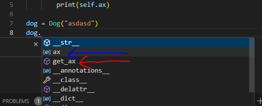

```
class ClassNameInCamelCase():
    def __init__(self):
        pass
    def some_method(self):
        pass

class DerievedClassNameInCamelCase(ClassNameInCamelCase):
    def __init__(self):
        ClassNameInCamelCase.__init__(self)
        pass
    def some_method(self):
        pass
```


One in blue arrow highlights attributes
One in red arrow highlights methods